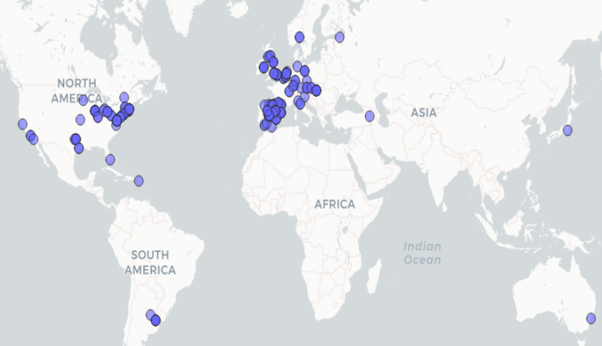

```{r}
#| include: false
#| label: cargando-los-paquetes
library(tidyverse)
```

# Intro

**Quarto** es un sistema diseñado para **elaborar documentos** con contenido científico-técnico

Un documento `.qmd` tiene 3 partes:

-   **Yaml**: para los metadatos del documento

-   **Código**: nosotros usaremos código R

-   **Narrativa**: escrita en [markdown]{.underline}

<br>

------------------------------------------------------------------------

# 1. Yaml

Veremos muchas opciones cuando repasemos la **plantilla** para confeccionar vuestros trabajos

<br>

------------------------------------------------------------------------

# 2. Código (R)

Podemos usar el código de 2 formas:

-   **Chunks**: trozos de código R independientes del texto

-   **Código inline**: código entremezclado con la narrativa, con el texto

## Chunks

```{r}
#| echo: false
plot(iris)
```

## Código inline

-   Puedes introducir código en el texto. Por ejemplo: El data.frame `iris` tiene `r nrow(iris)` filas y `r ncol(iris)` variables. La longitud media del sépalo es `r mean(iris$Sepal.Length)`. Esto es útil!!!

```{r}
#| echo: false
media_sepal_length <- round(mean(iris$Sepal.Length), digits = 2)
```

-   Puedes guardar el resultado de una operación en una variable y usarla en el texto. Por ejemplo, la media de la longitud del sépalo es `r media_sepal_length`. Esto es útil!!!

# 3. Texto (o narrativa)

Se escribe en **Markdown**. Es un lenguaje de marcado ligero que se convierte fácilmente en HTML.

Una excelente guía sobre Markdown la tenéis [aquí](https://www.markdownguide.org/)

## 3.1 Elementos básicos

Los **elementos básicos** que tenéis para escribir en Markdown son:

### Títulos

-   Se crean con `#` (h1), `##` (h2), `###` (h3), etc.

-   Tened cuidado de dejar espacio entre las marcas `#` y el texto

-   Tened cuidado de anidar correctamente los niveles de los títulos: `#`, `##`, `###`, etc.

### Formato básico el texto

Puedes usar los siguientes elementos para formatear el texto:

-   Trozos o palabras en **negrita**

-   Trozos o palabras en *cursiva*

-   Superíndices: por ejemplo R^2^

-   Subíndices: por ejemplo H~2~O

-   Tachado: por ejemplo ~~tachado~~

-   Formatear texto cómo código (verbatim code): por ejemplo `print("Hola mundo")`

-   Puedes poner citas: por ejemplo

> "La vida es aquello que te va sucediendo mientras te empeñas en hacer otros planes" (John Lennon)

<br>


### Más posibilidades para formatear el texto

-   Puedes poner [texto subrayado]{.underline}

-   Puedes poner <mark>texto destacado</mark>

-   **Notas al pie**: por ejemplo^[la marca `^` indica donde se situará la marca de la nota, y el texto de la nota va entre corchetes]

-   **Emojis**, por ejemplo: 😂

-   En realidad puedes usar cualquier **símbolo Unicode** en html, por ejemplo, el símbolo de derechos de autor: © ... o el símbolo de la raíz cuadrada: √ o : ⬐ o .... ✅.\
    Puedes encontrar un listado amplio de símbolos en [esta página](https://unicode-table.com/es/) 🌏 o en [esta otra](https://www.w3schools.com/charsets/ref_utf_math.asp). Por ejemplo: ∉ ♣


<br>

### Listas

**Lista no-numerada**:

-   item nº 1

-   item nº 2

**Lista numerada**:

1.  item nº 1

2.  item nº 2

**Lista Anidada**:

-   item nº 1
    -   subitem 1
    -   subitem 2

<br>

Puedes ver **listas más complejas** [aquí](https://quarto.org/docs/authoring/markdown-basics.html#lists)

<br>

## 3.2 Más elementos (de Markdown)

### Enlaces

-   Por ejemplo: [Quarto](https://quarto.org/)

-   Si quieres que el enlace se abra en una nueva pestaña: [Quarto](https://quarto.org/){target="_blank"}

### Imágenes

-   Puedes incluir imágenes en tu documento. Por ejemplo:

{fig-align="left" width="25%"}

-   Más opciones para incluir imágenes [aquí](https://perezp44.github.io/intro.to.quarto.2024/blog/24_imagenes.html)

<br>

### Tablas

-   Puedes incluir tablas en tu documento. Por ejemplo:

```{r}
iris %>% head() %>% DT::datatable()
```

<br>

-   Una de las sesiones de la semana que viene la dedicaremos a las tablas

### Ecuaciones

-   Se han de escribir en Latex.

-   Puedes poner ecuaciones de dos formas:

    -   Ecuaciones **inline** (se usa la marca `$`). Por ejemplo: $y = \beta_0 + \beta_1 x + \epsilon$

    -   Ecuaciones **independientes** (se usa la marca `$$`). Por ejemplo:

$$y = \beta_0 + \beta_1 x + \epsilon$$

-   Si no sabes Latex. Puedes ir [aquí](https://www.latex4technics.com/) o [aquí](https://www.sciweavers.org/free-online-latex-equation-editor)

-   Muchas veces podemos reusar el código Latex de ecuaciones en la web (si se ha usado MathJax). Por ejemplo [aquí](https://perezp44.github.io/VAR-models-web/03-Slides.html)


<br>

--------------------

<br>


# 4. Editor Visual

-   A vosotros seguro que os resulta útil el **editor visual** de Quarto. Podéis activarlo en la esquina superior derecha del editor.

-   Una guía rápida [aquí](https://perezp44.github.io/intro-ds-24-25-web/materiales/slides_07b_intro-a-Quarto.html#/rstudio-visual-editor)


<br>

--------------------

<br>


# 5. Más elementos (de Quarto)


## 5.1 Slides

- Una introducción [aquí](https://perezp44.github.io/intro-ds-24-25-web/materiales/slides_07b_intro-a-Quarto.html#/presentaciones-con-quarto-generico)

- Una introducción más completa [aquí](https://perezp44.github.io/intro.to.quarto.2024/slides/04_revealjs.html#/title-slide)


<br>

## 5.2 Tabsets

Los **tabsets** son una forma de organizar el contenido en pestañas. Por ejemplo:

::: {.panel-tabset}
### El código

Aquí tenemos el código para hacer  un plot

```{r}
#| eval: false
plot(iris)
```

### El plot

Vemos el plot

```{r}
#| echo: false
plot(iris)
```

### Todo junto

😀

```{r}
plot(iris)
```
:::


<br>


## 5.3 Cuadritos

Sirven para resaltar contenido. Por ejemplo:

### Call-outs

Los **call-outs** son una forma de resaltar contenido. Por ejemplo:


::: {.callout}
El viernes tenéis que mandarme un mail con un breve resumen de lo que haréis en el trabajo y qué datos usaréis
:::

::: {.callout-note}
Hay 5 tipos de call-outs: `note`, `tip`, `warning`, `caution`, and `important`.

La documentación oficial está [aquí](https://quarto.org/docs/authoring/callouts.html)
:::


::: {.callout-tip collapse="true" icon="false" title="Este call-out puedes expandirlo" }
Si te gusta el tema de los call-outs, puedes ver [este video](https://www.youtube.com/watch?v=DDQO_3R-q74)
:::

### Alerts

Los **alerts** son otra forma de resaltar contenido. Por ejemplo:

::: {.alert .alert-info}
Esto es un mensaje de información
:::

::: {.alert .alert-warning}
Mensaje de warning
:::

::: {.alert .alert-danger}
Alerta!!!!
:::


<br>

## 5.4 Divs y Spans

- Son elementos que permiten **tunear** partes del documento. Documentación [aquí](https://quarto.org/docs/authoring/markdown-basics.html#sec-divs-and-spans)


- Un ejemplo de uso de Div's:

::: {.border}
This content can be styled with a border
:::


- Otro ejemplo:

::: {.border .border-primary}
This content can be styled with a border
:::

<br>

- Un ejemplo de uso de Span's:

  Un trocito de esta frase irá [con un borde]{.border}. ¿Te das cuenta?
  
- Otro ejemplo: 

  Un trocito de esta frase irá [con un borde]{.border .border-primary}. ¿Te das cuenta?


<br>

- **Otros ejemplos**:

  - Este texto es tiene una parte de color  [rojo]{style="color: red"} 
  
  - Este texto tiene una parte en [fondo verdecito]{style="background-color: #7FFFD4;"}; 
  
  - Este texto tiene una parte [en rojo y fondo amarillo]{style="color: red; background-color: yellow;"}.


<br>


## 5.5 CSS(tuneando el documento)

- Podemos **tunear** el documento con CSS. Por ejemplo, podemos cambiar el color de fondo de los títulos:


```{css}
h5 {
  background-color: #f09999;
  font-size: 33px;
}
```

<br>

- Otro ejemplo: definimos la clase "bigtext

```{css}
.big-text {
  font-size: 33px;
}
```

  Una vez definida la clase `.big-text`, podemos usarla en un `div` o en un `span`
  
<br>
  
::: {.alert .alert-warning .big-text}
Este texto se verá muy grande
:::

<br>

En esta frase una palabra se verá muy [grande]{.big-text} 

En esta frase algo se verá [muy grande y en un cuadrito]{.alert .alert-warning .big-text}

<br>

### Usando mejor el CSS

- Los estilos CSS se suelen guardar en un archivo externo. Para usarlos has de llamar al archivo en el documento. Por ejemplo, has de incluir en el `YAML` lo siguiente:

```yaml
css: "ruta/al/archivo.css"
```

- Si quieres saber un poco más, puedes empezar por [aquí](https://perezp44.github.io/intro.to.quarto.2024/blog/25_css.html)

<br>

---------------------

<br>

## 5.5 Más cosas

### Layout's

Conocer el **Layout** sirve para organizar el contenido de tu documento. Documentación oficial [aquí](https://quarto.org/docs/authoring/article-layout.html). [Aquí](https://perezp44.github.io/intro.to.quarto.2024/blog/21_layouts.html) un post


#### Ejemplo

- Por ejemplo, si queremos que algo vaya en el margen del documento. Documentación [aquí](https://quarto.org/docs/blog/posts/2022-02-17-advanced-layout/)


```{r}
#| column: margin
plot (iris)
```

<br><br><br>

#### Ejemplo


- Por ejemplo, si queremos que una parte vaya en **2 columnas**, podemos usar:


:::: {.columns}
::: {.column width="70%"}
 Esta columna ocupara el 70% de la página
:::

::: {.column width="10%"}
<!-- empty column to create gap -->
:::

::: {.column width="20%"}
Esta columna ocupara el 20% de la página
:::

::::


<br>


### Extensiones

Quarto tiene multitud de extensiones. Documentación oficial [aquí](https://quarto.org/docs/extensions/starter-templates.html). [Aquí](https://quarto.org/docs/extensions/listing-filters.html) las extensioes oficiales. [Aquí](https://m.canouil.dev/quarto-extensions/) más extensiones. [Aquí](https://github.com/mcanouil/awesome-quarto) un lista awesome de Quarto, y [aquí](https://perezp44.github.io/intro.to.quarto.2024/blog/23_extensiones.html) un post


